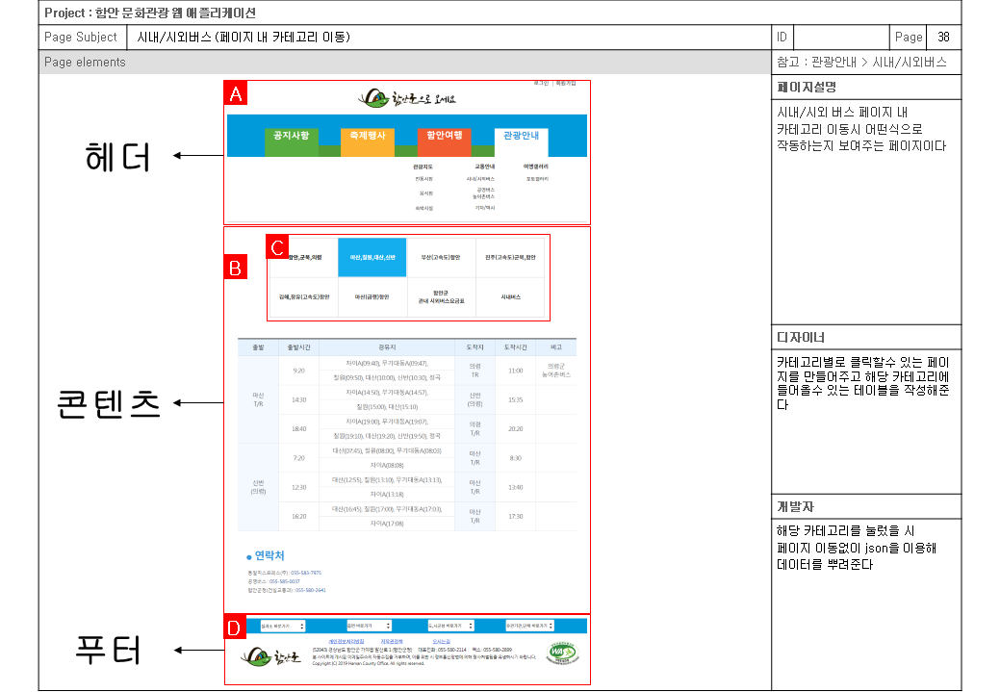
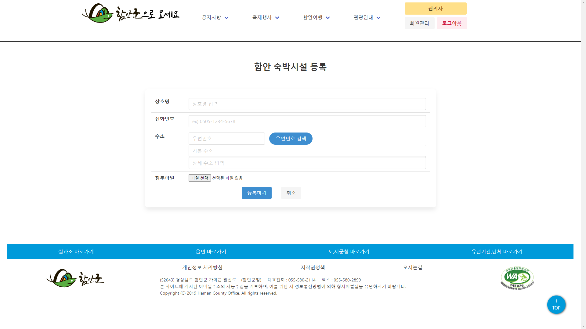

# 프로젝트 개요
## 프로젝트 명 : 함안 관광청
## 프로젝트 기간 : 2023.05.17 ~ 06.01
## 프로젝트 참여  : 조태정, 김우주
## JAVA ver : 1.8.0_241
## IDE(통합개발도구) : Eclipse Luna
## JAVA script ver : 1.0
## Dynamic Web Module : 3.1
## DBMS : MySQL 8.0.28 + MySQL Workbench 8.0 CE + ANSI SQL Query
## External Library : json , cos , commons , crypto 
## JAVA Script Plugin : JQuery
## Css FrameWork : bulma.io v0.9.4
## JAVA Script API : DAUM 주소 API , json 데이터 처리 , 카카오지도 api
## 프로젝트 데이터 처리패턴 : MVC2
- View -> Controller > Model > Controller > View

 

## 프로젝트 주요 기능 : 회원, 공지사항, 리뷰, 다음api활용, 고객민원(QNA), 페이징처리 등

 

## 프로젝트 특이사항
### 회원 가입
- 회원가입 시 회원 약관에 동의해야 회원가입 페이지로 넘어가도록 구현
- 아이디 중복체크 시 json을 이용해 현재 창에서 구현
- 비밀번호는 AES256을 이용하여 암호화 처리하여 저장
- 주소의 입력은 DAUM 주소 API를 활용하여 입력받아 저장

### 공지사항(게시판)
- 관리자계정(admin)만 모든 글의 수정 및 삭제가 가능함
- 첨부파일 기능을 구현하여 업로드가 가능
- 해당하는 글에 들어가 업로드되어 있는 파일 다운로드 가능
- 썸네일과 본문에 올라갈 사진 페이지를 구현
- 페이지 기능을 구현함 

### 별점(리뷰)
- json을 이용해 해당 음식점/숙소에 별점을 남기도록 구현
- 악의적으로 별점을 낮출 수 있기에 회원 한 명당 한 개의 음식점/숙소에만 별점을 남길 수 있음 

### 고객민원QnA
- 민원인 정보 보호를 위해 자신의 민원만 볼 수 있도록 구현
- 민원인 정보 보호를 위하여 민원은 10개까지만 수집
- 답변은 관리자만 등록할 수 있도록 구현
- 답변이 등록되지 않은 민원은 답변 대기로 표시하도록 구현
- 답변이 등록된 민원은 답변 완료로 표시하도록 구현

### 음식점 및 숙소
- 해당 음식점 또는 숙소에 별점을 구현
- 길찾기 페이지에 주소를 이용해 연결되도록 구현
- 관리자가 음식점 및 숙소의 수정, 추가, 삭제 기능이 용이하도록 구현

### 포토갤러리
- 로그인한 사용자만 글을 쓸 수 있도록 구현
- multipart폼을 이용해 파일 첨부 및 첨부한 파일을 페이지에 나타내도록 구현
- 관리자이거나 본인의 글인 경우 수정 및 삭제 기능 구현
- 댓글 기능 구현

### 관리자
- 관리자는 회원정보를 수정 , 조회 및 탈퇴가 가능하여야 한다
- 관리자는 공지사항의 등록, 수정 및 삭제가 가능하여야 한다
- 관리자는 숙소 게시판의 등록 수정 및 삭제가 가능하여야한다
- 관리자는 음식점 게시판의 등록 수정 및 삭제가 가능하여야 한다
- 관리자는 질문 및 답변에서 질문 내용 수정은 못하지만 삭제할 수있어야 하며, 그에 대한 답변을 달 수 있어야 한다

---

# 프로젝트 설계
## 개념적 설계 (유스케이스)
- 유스케이스

---
## 논리적 설계 (검증 표)
- 논리 검증 체크리스트

---
## 물리적 설계
- 데이터베이스 ERD

---
## 클래스 설계
- 클래스 다이어 그램

---

## 프로젝트 구성
- (리소스구성도)

---

## 스토리보드

---

# 기능구현

### 메인

### 회원관련 기능으로는 로그인 , 회원탈퇴 , 수정 , 회원가입을 구현함
### 로그인

### 관리자 기능으로는 관리자만 민원 답변을 달수 있고 회원 목록을 불러와
### 수정 및 강퇴 가 가능하며 공지사항 , 숙소소개 , 맛집소개등의 
### 게시판에 글을쓸수 있는 권한을 지님

### 공지사항 기능으로는 페이징처리 , 썸네일사진 , 본문사진, 수정 삭제 글쓰기 등이 있음

### 민원 기능으로는 회원의경우 자신의 민원은 10개까지만 노출되며
### 답변상태를 알수있게끔 답변완료 , 답변 대기로 나뉨
### 관리자의 경우 모든 민원을 볼 수 있으며 답글을 달 수 있음
")

### 서브페이지는 작은 사진을 누를시 큰사진과 교체되어 더 크게 볼 수 있고
### 지도 api를 연동하여 글을 수정하거나 할 시 알아서 지도의 좌표가 해당하는 주소로 바뀜

### 숙소소개 게시판및 음식점 게시판 등록 수정 삭제가 가능하며
### 길찾기 시 해당 음식점 주소를 받아 구글맵과 연동해줘 자동으로 해당 음식점의 주소가 도착지로 설정됨
### 페이징 처리가 필요한 모든 페이지들은 페이징 처리를 해줬음
### 리뷰기능을 구현하여 해당 숙소에 별점을 줄 수있고 json을 사용하여 처리하여 페이지의 이동이 필요없음
### 이미 리뷰를 준 사람이 악의적으로 반복하여 별점을 깎을수 있기에 한사람당 한 게시글에 한번씩만 주도록 함

### 해당 페이지에 업로드된 파일을 받을 수 있음

